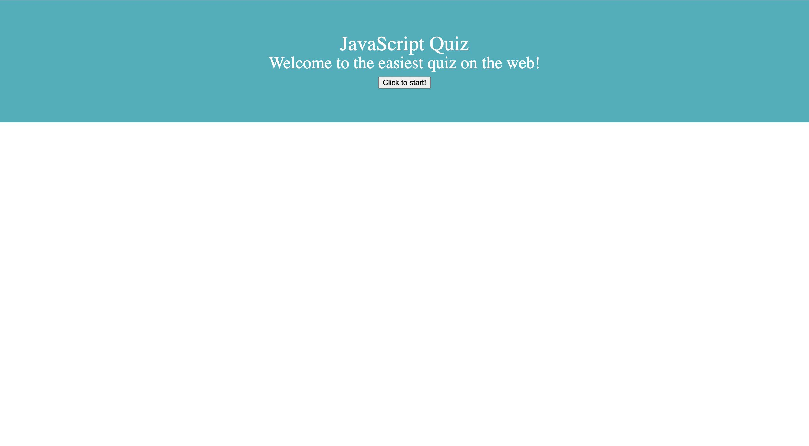

# JavaScript Code Quiz
Boot Camp HW #4

## Project Description

  - Created a code quiz with at least five multiple choice questions.
  - When user clicks the start button at the beginning, a timer starts giving the user 60 seconds to complete the quiz.
  - Each correct answer earns a point and user moves on to next question.
  - When a question is answered incorrectly, 3 seconds is removed from the clock.
  - When all questions are answered correctly OR the timer hits 0, the quiz is over.
  - When the game is over the user can save their initals and score.

## Screenshots

## Website link
https://cleadi.github.io/code-quiz/